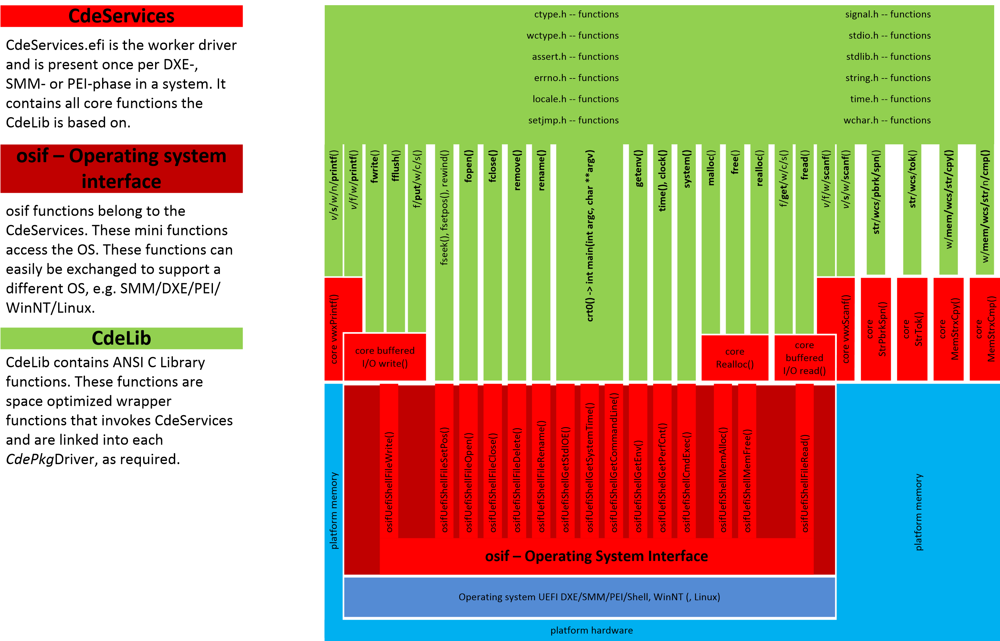
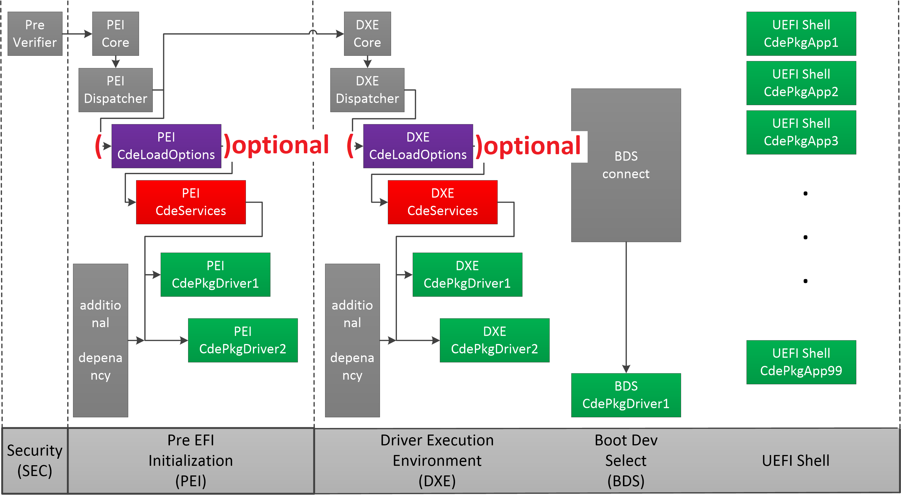

# CdePkg
C Development Environment Package for EDK2 and derived BIOS products.
* [Preface](README.md#preface)
* [Introduction](README.md#introduction)
* [Intention](README.md#intention)
* [Implementation](README.md#implementation)
	* [Interface architecture](README.md#interface-architecture)
	* [CdeLoadOptions/command line](README.md#cdeloadoptions--command-line)
	* [Boot flow architecture](README.md#boot-flow-architecture)
* [Status](README.md#status)
	* [todo](README.md#todo)
* [Howto](README.md#howto)
* [Related Projects](README.md#related-projects)
* [Revision history](README.md#revision-history)

<!--  -->

C Development Environment Package for EDK2
## Preface
The programming language C is standardized by the American National Standards Institute (ANSI) and the
International Organization for Standardization (ISO) first in 1989 and 1990.
The latest publicly available version of the standard from 1999 is to be found here: [C99](http://www.open-std.org/JTC1/SC22/WG14/www/docs/n1256.pdf).
The original [ANSI C](https://1drv.ms/b/s!AmMwYrfjYfPyhmLlWx7oT5rO6UDg?e=Am2R2v), also known as C89 or
C90 is not officially available anymore for free.

Both, the *language* (operators, expressions, declarations, specifiers, e.g. `if`, `while`,
`+`, `&&`, `unsigned`, `char`, `struct` ...) and the *library* (functions, parameters, structures, macros, 
e.g. `NDEBUG`, `CLOCKS_PER_SEC`, `raise()`, `scanf()`, `struct lconv`, `struct tm`, `errno` ...) are specified in this document (chapters 6 and 7)
and are obligatory for an implementation that claims to meet the standard.

In a particular C compiler / C library implementation both are completely coordinated to 
each other.

The Microsoft C/C++ compiler and its library LIBCMT.lib is an implementation of this standard;
it is primarily designed to create C/C++ programs and drivers for the Windows Operating System; 
it is surely the most frequently used C compiler of them all and continuously enhanced, updated and
maintained by Microsoft.

This compiler is not a stand alone executable that simply translates C/C++ sourcecode to object 
modules. It is closely entwined with different build environments (WDK/DDK, SDK) consisting of libraries,
headerfiles, the operating system interface and platforms (x86-64/32, ARM64/32) to meet required code safety, code optimization 
(size vs. speed in different shades) and maintainability (e.g. for debug and trace purpose).

The code generation and optimization aspects are not completely documented by Microsoft
but the Microsoft compiler tends to produce machine code, that relies on the presence of
C library specified functions for storage space initialization, comparison and duplication 
(`memset()`,`strcpy()`, `strcmp()`). Additionally some still undocumented function calls
are produced by  the x86-32 code generator, when dealing with 64 bit integer types (`long long`),
that came into the C language standard in 1999.

## Introduction
**CdePkg**, C Development Environment Package, introduces the use of ***Hosted Environment***,
as specified by ANSI C, for both UEFI POST and SHELL drivers.
This is a reference implementation only, using the Microsoft C compiler, linker, library 
manager and IDE that comes with Visual Studio 2019 for x86 platforms.

A *Hosted Environment* for command line applications is standard, its introduction for drivers is a **novum**. This also applies for the UEFI environment. But the wealth of computing power of current UEFI machines offers the chance to translate ANSI C
compatible sourcecode to run as UEFI POST driver.

With the growing complexity of firmware due to the requirements for both security and trust and the
need for speed in development, use of platform-independent sourcecode allows:
* reuse of validated C sourcecode (from different origins, e.g. the open source community)[<sup>1</sup>](https://github.com/KilianKegel/CdePkg/blob/master/footnotes/footnote-1.md)
* crossdevelopment of complex firmware code on non-UEFI platforms with superb build and debug capabilities
* use of static code analysis tools[<sup>2</sup>](https://github.com/KilianKegel/CdePkg/blob/master/footnotes/footnote-2.md)
* appraisal of the source code quality by human professionals[<sup>3</sup>](https://github.com/KilianKegel/CdePkg/blob/master/footnotes/footnote-3.md)

Since the UEFI "OS" interface (DXE/SHELL/SMM and PEI) can be accessed directly by the compiler-translated sourcecode and UEFI provides an independent set of functions, macros and type definitions, ANSI C and UEFI "OS" specific sourcecode can coexist seamlessly. 
This allows a functional ANSI C prototype to adjust successively to real world driver requirements in the UEFI environment. 
A UEFI SHELL application might be an intermediate step for this process if the target is a DXE or SMM driver.

## Intention
**CdePkg** is a feasibility study on how to provide a complete *Hosted Environment* 
(according to ANSI C Specification chapter 5.1.2) including all instrisic functions, 
which the compiler requires to be a **full featured C-compiler**, in particular the full
set of C-language operators (specifically `/`, `%`, `<<`, `>>` for 64 bit integers) for the 32 bit code generator, needed in PEI.

Furthermore the questions has to be answered, if UEFI based products can be improved regarding
* software quality (in terms of number of required updates during a life cycle)
* development time
* feature set (complexity and quantity)
* storage space needed in a flash part (the smaller the better)

...if a standardized programming interface as ANSI C is available, in conjunction with a storage space optimization
strategy, as described below, that splits *wrapper libraries* from *worker drivers*.

In the UEFI programming environment not even the smallest piece of code can be cross developed on a
different platform, since function names differ in upper/lower case letters, format specifier for
`Print()`-functions differ from C's `printf()`, a `scanf()` counterpart is absent, wideness
of stringtypes differs from corresponding ANSI C functions.

Since in many cases the ANSI C specification allows freedom for a particular library implementation 
(return values, flags, structure layout) but the chosen build and debug environment is VS2019 the original
Microsoft C Library functions had to be recreated, fully compatible, bug for bug (except otherwise noted). 
This would provide the most relieable solution for cross development, enable the use of the original
Microsoft header files and prevent from documenting yet another C Library implementation.

A *Hosted Environment* provides the following obligatory features: 
* [`int main(int argc,char **argv)`](https://docs.microsoft.com/en-us/cpp/c-language/main-function-and-program-execution?view=vs-2019) is the driver entry point[<sup>4</sup>](https://github.com/KilianKegel/CdePkg/blob/master/footnotes/footnote-4.md)
* `argc` and `argv` are used for parameter passing, in **CdePkg** also for POST drivers<br>https://docs.microsoft.com/en-us/cpp/c-language/parsing-c-command-line-arguments?view=vs-2019
* full blown ANSI C library
* buffered I/O, that means that [`ungetc()`](https://docs.microsoft.com/en-us/cpp/c-runtime-library/reference/ungetc-ungetwc?view=vs-2019) works on streams, beside an improvement in speed
* [`exit()`](https://docs.microsoft.com/en-us/cpp/c-runtime-library/reference/exit-exit-exit?view=vs-2019) invocation on driver termination, that implies
    * run [`atexit()`](https://docs.microsoft.com/en-us/cpp/c-runtime-library/reference/atexit?view=vs-2019)-registered functions
    * free allocated memory 
    * remove all tempfiles (not applicable for POST drivers)
    * close open files (not applicable for POST drivers)

The command line parameter / load options for each *CdePkg*Driver shall be able to be adjusted
on a final system without recompiling the BIOS and updating the BIOS chip.
This e.g. allows the support engineer to change BIOS behaviour on a (partially)
defect system for repair/debug mode, enabling trace messages, excluding special
(non-compliant) devices from beeing enumerated. 

## Implementation
**CdePkg**'s functionality is composed of three components:
  1. the C Library **CdeLib**
  2. the service driver **CdeServices**
  3. the POST command line reference implementation [**CdeLoadOptions**](https://github.com/KilianKegel/CdePkg/tree/master/CdeLoadOptionsDxe)

all in 32 and 64 bit variants for DXE, SMM and PEI each.

**CdeLib** and **CdeServices** are highly optimized for space minimized appearance of 
ANSI C library functions in the UEFI drivers. This is achieved by implementing all-embracing worker functions

* `printf()`-family core
* `scanf()`-family core
* `realloc()` core (`malloc()`, `free()`, `realloc()` and `calloc()`)
* `strcmp()`-family core (all `str`/`wcs`/`mem` `n` `i` functions)
* `strcpy()`-family core (all `str`/`wcs`/`mem` `n` functions)
* `strpbrk()`/`strspn()` -family core (all `str`/`wcs` `pbrk`- and `spn`- functions)
* `strtok()`-family core (all `str`/`wcs` `tok`-functions)
* CRT0 startup code for DXE, SMM, PEI
* buffered I/O core (`fread()`, `fwrite()` and `ungetc()`)
* locale character tables
* interface functions to access DXE- and PEI-API

in the **CdeServices** driver, that resides once in DXE-, SMM- and PEI-phase each.
The **CdeLib** just provides small wrapper functions that invoke **CdeServices**.

### Interface architecture


### **CdeLoadOptions** / command line
Each *CdePkg*Driver reports its EfiCallerIdGuid while running through CRT0 to **CdeLoadOptions**.
**CdeLoadOptions** provides a pointer to the matching "Command Line" from an simple EfiCallerIdGuid/CommandLine table
within the file [`CdeLoadOptions.h`](https://github.com/KilianKegel/CdePkg/blob/master/Include/CdeLoadOptions.h), 
compiled into the [**CdeLoadOptions**](https://github.com/KilianKegel/CdePkg/blob/master/CdeLoadOptionsDxe/CdeLoadOptionsDxe.c) driver binary.

**This is just a proof of concept. In a real implementation, as mentioned above, the command line can be
changed without recompilation and BIOS update.**

### Boot flow architecture

The Boot flow sequence consists of: 

1. PEI CdeLoadOption (to provide the commandline to PEI drivers)
2. PEI CdeServices (to provide the space optimized worker functions)
3. PEI custom drivers (CdeServicesPei-based)
4. DXE CdeLoadOption (to provide the commandline to DXE drivers)
5. DXE CdeServices (to provide the space optimized worker functions)
6. DXE custom drivers (CdeServicesDxe-based)
7. BDS custom drivers
8. UEFI Shell drivers (CdeServicesDxe-based, yet still Torito-C-Library-based)



## Status
The **CdeLib** and **CdeServices** are derived from their companion project 
[Toro C Library](https://github.com/KilianKegel/torito-C-Library) but
split into *wrapper*/*worker* architecture. (Internally [Torito C Library](https://github.com/KilianKegel/torito-C-Library)
was designed from the very beginning for that split architecture, but  library and driver were merged into one executable, to
run on platforms without **CdeServices** protocol.)

The functions below are already implemented and tested, every single one of them, except otherwise noted:

[List of available functions](https://github.com/KilianKegel/toro-C-Library/blob/master/implemented.md)


[Toro C Library](https://github.com/KilianKegel/torito-C-Library#torito-c-library) has passed extensive
tests to verify Microsoft's C Library compatibility and is also approved in various real world applications.
Therefore the **CdePkg**'s C library will be validated by simple tests only, in the [CdeValidationPkg](https://github.com/KilianKegel/CdeValidationPkg#cdevalidationpkg), for DXE, SMM and PEI respectively.

### todo
* add simple UART based (COM1) CON I/O interface since consoles are not supported during POST
* <del>add SMM support</del>
* 20190714 <del>add PEI support</del>
* move CRT0 startup code to **CdeServices**
* move local character tables to **CdeServices**
* move buffered I/O core to **CdeServices**
* validate functions in DXE, SMM and PEI [List of available functions](https://github.com/KilianKegel/torito-C-Library/blob/master/implemented.md#validation-status)
* complete library implementation

## Howto
1. **CdePkg** is a submodule of the [**EDK2020-MinnowBoard**](https://github.com/KilianKegel/EDK2020-MinnowBoard.git) project.<br> https://github.com/KilianKegel/EDK2020-MinnowBoard#howto-installbuildedit
2. run **LAUNCH.BAT**, that will
    1. check build tools are installed
    2. download NASM and OPENSSL tools
    3. download EDK2 and EDK2-NON-OSI from tianocore and CdeBinPkg
    4. setup the build environment variables
3. Create and debug a new **CdePkg** driver<br>
   The [CdeValidationPkg](https://github.com/KilianKegel/CdeValidationPkg#cdevalidationpkg) can be used
   to create and debug **CdePkg**-based drivers<br>
4. Convert an existing, traditional **MdePkg** driver to a **CdePkg** driver
    1. adjust the .INF file according image below
    	
    2. adjust the DriverEntryPoint-C-Sourcecode according to the image below
    	
5.  Adjust the drivers command lines for the MinnowBoard POST drivers
    1. copy `LoadOption.efi` tool from the UEFIBinaries folder to the UEFI Boot device
    2. copy `delall.nsh`, `disall.nsh`, `setall.nsh` and `enaclock.nsh` scripts to the UEFI Boot device
    3. run `setall.nsh` to enable the approbriate command line to each `CdeValidationPkg` driver
    4. run `disall.nsh` to prevent each driver from being started
    5. run `enaclock.nsh` to enable the `clock.efi` and the `argvc.efi` driver only
    6. use `LoadOption.efi` to adjust each driver for your own needs

## Related Projects
| related project|annotation|
|:-|:-|
|[toro C Library](https://github.com/KilianKegel/torito-C-Library#torito-c-library)|C Library for UEFI Shell only. All projects below are built on or derived from *Torito C Library*|
|[Visual ANSI C for UEFI Shell](https://github.com/KilianKegel/Visual-ANSI-C-for-UEFI-Shell#visual-ansi-c-for-uefi-shell)|Getting started with Visual Studio for UEFI Shell and ANSI C cross-development.
|[Visual DOS Tools for UEFI Shell](https://github.com/KilianKegel/Visual-DOS-Tools-for-UEFI-Shell#visual-dos-tools-for-uefi-shell)|more, find command implementation|
|[Visual HWTools for UEFI Shell](https://github.com/KilianKegel/Visual-HWTools-for-UEFI-Shell#visual-hwtools-for-uefi-shell)|HWTools: PCI- and GPIOSpy for Baytrail. MemSpy for all.|

## Revision history
### 20251004, v0.9.8 Build 797
* fix **C++ `delete` operator** n/a in 32Bit library<br>
* default **toolset/SDK** configuration is now **VS2026 v145/10.0.26100.0** 
### 20250913, v0.9.7 Build 764
* fix [**errno.h**]((https://www.open-std.org/JTC1/SC22/WG14/www/docs/n1256.pdf#page=198)) support for [**math.h** functions](https://www.open-std.org/JTC1/SC22/WG14/www/docs/n1256.pdf#page=224) in **UEFI POST drivers** (Power On Self Test)<br>
### 20250906, v0.9.6 Build 757
* fix buffer flush in `fprintf()`-family functions

### 20250830, v0.9.5 Build 755
* add [**errno.h**]((https://www.open-std.org/JTC1/SC22/WG14/www/docs/n1256.pdf#page=198)) support for [**math.h** functions](https://www.open-std.org/JTC1/SC22/WG14/www/docs/n1256.pdf#page=224)
    - `EDOM` for domain errors
    - `ERANGE` for range errors
* publish **math.h** [**C-Validation Suite results**](https://github.com/KilianKegel/toroCVSreport?tab=readme-ov-file#mathh)

### 20250720, v0.9.4 Build 672
* **add LLVM/CLANG-cl-family support — the library source code itself is now buildable with LLVM/CLANG-cl:**
    * support VS2022 v17.14 with **LLVM (clang-cl)** tool chain
    * support **Intel C++ Compiler 2024** tool chain<br>
      **NOTE:** Only [**Intel oneAPI Base Toolkir ver 2024.2.1**](https://www.intel.com/content/www/us/en/developer/tools/oneapi/base-toolkit-download.html)
      provides the 32Bit compiler.<br>In versions **2025.x.y** the 32Bit compiler isn't shipped anymore.
* Windows SDK version **10.0.26100.0**
* support Microsoft tool chain:
    * **v143(VS2022)**
    * **v142(VS2019)** 
    * **v141(VS2017)**

### 20250712, v0.9.3 Build 298
* add C++ `virtual` function support by providing [Microsoft `type_info`](https://learn.microsoft.com/en-us/cpp/cpp/type-info-class?view=msvc-170) intrinsic

### 20250706, v0.9.2 Build 289
* fix fatal compiler optimization bug with  **Visual Studio 2022 v17.14**
    * [`memcpy()`](https://github.com/KilianKegel/Visual-TORO-C-LIBRARY-for-UEFI/blob/main/toroCLibrary/Library/string_h/MemCpy.c) and [`wmemcpy()`](https://github.com/KilianKegel/Visual-TORO-C-LIBRARY-for-UEFI/blob/main/toroCLibrary/Library/wchar_h/WMemCpy.c) recursively call `memcpy()`

### 20250322, v0.9.1 Build 267
* introduce **toro C Library** for the **Microsoft VS2022 LLVM tool chain** for **Windows NT** and **UEFI Shell** targets<br>
    - toroc64LLVMUefiShell.lib
    - toroc64LLVMWinNT.lib
    - toroc32LLVMUefiShell.lib
    - toroc32LLVMWinNT.lib

  **NOTE:** The LLVM linker **lld-link** can't deal with the multi-entrypoint library **toro C Library** directly.<br>
            To remedy this, the **toro C Library** is simply split into the above separate libraries.
* fix double float representation using printf()-**%G**-format specifier used in [**libxlsxwriter**](https://github.com/KilianKegel/Visual-LIBXLSXWRITER-for-UEFI-Shell#visual-libxlsxwriter-for-uefi-shell).
* fix [`pow()`](https://github.com/KilianKegel/Visual-TORO-C-LIBRARY-for-UEFI/blob/main/toroCLibrary/Library/math_h/pow.c): **+/-infinity<sup>negative number</sup>**
* add missing import library version of [`wctob()`](https://github.com/KilianKegel/Visual-TORO-C-LIBRARY-for-UEFI/blob/main/toroCLibrary/Library/wchar_h/wctobCDEABI.c)

### 20250504
* W/A for **cdeWelcomePei** sample driver when started with **gEfiPeiMemoryDiscoveredPpiGuid** depex hangs on some systems
### 20250309, v0.9.0 Build 243
#### finalize MATH.H implementation
<br>
The architecture of this math library introduces a space optimized implementation of C's MATH.H functions,
while keeping precision and correctness as good as already known in earlier x87-based math libraries.<BR>
Since the traditional math coprocessor 80387 is still present in current x86 processors and is also not deprecated
in the [X86S specification](https://www.intel.com/content/www/us/en/developer/articles/technical/envisioning-future-simplified-architecture.html) [.PDF](https://github.com/KilianKegel/4KPages-TechDocs/blob/main/x86s-eas-external-1.1.pdf),
it can be used here.<br><br>
The 80387 processor has various improvements over its 8087 predecessor, such as<br>
  * range extension for transcendental function:

    | Instruction  | function           |
    |--------------|--------------------|
    |FPTAN         | Partial tangent    |
    |FPATAN        | Partial arctangent |
    |F2XM1         | 2<sup>x</sup> - 1  |
    |FYL2X         | Y * log2X          |
    |FYL2XP1       |Y * log2(X + 1)       |
    
* new instructions, e.g.

    | Instruction  | function                 |
    |--------------|--------------------------|
    |FXAM          |  Examine Floating-Point  |
    |FSIN          | sine                     |
    |FCOS          | cosine                   |

That has reduced the programming effort dramatically and made algorithms very simple and easy to implement.<br>

* [`acos()`](https://github.com/KilianKegel/Visual-TORO-C-LIBRARY-for-UEFI/blob/main/toroCLibrary/Library/math_h/acos.c)
* [`asin()`](https://github.com/KilianKegel/Visual-TORO-C-LIBRARY-for-UEFI/blob/main/toroCLibrary/Library/math_h/asin.c)
* [`atan()`](https://github.com/KilianKegel/Visual-TORO-C-LIBRARY-for-UEFI/blob/main/toroCLibrary/Library/math_h/atan.c)
* [`atan2()`](https://github.com/KilianKegel/Visual-TORO-C-LIBRARY-for-UEFI/blob/main/toroCLibrary/Library/math_h/atan2.c)
* [`ceil()`](https://github.com/KilianKegel/Visual-TORO-C-LIBRARY-for-UEFI/blob/main/toroCLibrary/Library/math_h/ceil.c)
* [`cos()`](https://github.com/KilianKegel/Visual-TORO-C-LIBRARY-for-UEFI/blob/main/toroCLibrary/Library/math_h/cos.c)
* [`cosh()`](https://github.com/KilianKegel/Visual-TORO-C-LIBRARY-for-UEFI/blob/main/toroCLibrary/Library/math_h/cosh.c)
* [`exp()`](https://github.com/KilianKegel/Visual-TORO-C-LIBRARY-for-UEFI/blob/main/toroCLibrary/Library/math_h/exp.c)
* [`fabs()`](https://github.com/KilianKegel/Visual-TORO-C-LIBRARY-for-UEFI/blob/main/toroCLibrary/Library/math_h/fabs.c)
* [`floor()`](https://github.com/KilianKegel/Visual-TORO-C-LIBRARY-for-UEFI/blob/main/toroCLibrary/Library/math_h/floor.c)
* [`fmod()`](https://github.com/KilianKegel/Visual-TORO-C-LIBRARY-for-UEFI/blob/main/toroCLibrary/Library/math_h/fmod.c)
* [`frexp()`](https://github.com/KilianKegel/Visual-TORO-C-LIBRARY-for-UEFI/blob/main/toroCLibrary/Library/math_h/frexp.c)
* [`ldexp()`](https://github.com/KilianKegel/Visual-TORO-C-LIBRARY-for-UEFI/blob/main/toroCLibrary/Library/math_h/ldexp.c)
* [`log()`](https://github.com/KilianKegel/Visual-TORO-C-LIBRARY-for-UEFI/blob/main/toroCLibrary/Library/math_h/log.c)
* [`log10()`](https://github.com/KilianKegel/Visual-TORO-C-LIBRARY-for-UEFI/blob/main/toroCLibrary/Library/math_h/log10.c)
* [`modf()`](https://github.com/KilianKegel/Visual-TORO-C-LIBRARY-for-UEFI/blob/main/toroCLibrary/Library/math_h/modf.c)
* [`pow()`](https://github.com/KilianKegel/Visual-TORO-C-LIBRARY-for-UEFI/blob/main/toroCLibrary/Library/math_h/pow.c)
* [`sin()`](https://github.com/KilianKegel/Visual-TORO-C-LIBRARY-for-UEFI/blob/main/toroCLibrary/Library/math_h/sin.c)
* [`sinh()`](https://github.com/KilianKegel/Visual-TORO-C-LIBRARY-for-UEFI/blob/main/toroCLibrary/Library/math_h/sinh.c)
* [`sqrt()`](https://github.com/KilianKegel/Visual-TORO-C-LIBRARY-for-UEFI/blob/main/toroCLibrary/Library/math_h/sqrt.c)
* [`tan()`](https://github.com/KilianKegel/Visual-TORO-C-LIBRARY-for-UEFI/blob/main/toroCLibrary/Library/math_h/tan.c)    
* [`tanh()`](https://github.com/KilianKegel/Visual-TORO-C-LIBRARY-for-UEFI/blob/main/toroCLibrary/Library/math_h/tanh.c)

**All these functions run also in UEFI POST stages PEI, DXE, SMM.**

### 20250222, v0.8.9 Build 231
* fix build error with **Windows SDK 10.0.26100.0**
### 20241222, v0.8.9 Build 227
* fix [`abort()`](https://github.com/KilianKegel/Visual-TORO-C-LIBRARY-for-UEFI/blob/main/toroCLibrary/Library/stdlib_h/abort.c)
  processes [`atexit()`](https://github.com/KilianKegel/Visual-TORO-C-LIBRARY-for-UEFI/blob/main/toroCLibrary/Library/stdlib_h/atexit.c)
  registered functions and closes files before exit.
* fix [`memset()`](https://github.com/KilianKegel/Visual-TORO-C-LIBRARY-for-UEFI/blob/main/toroCLibrary/Library/string_h/MemSetCDEINTRINABI.c)
  to do solely 8Bit memory machine operations.
* add Microsoft C Library functions: 
    - [`_exit()`](https://github.com/KilianKegel/Visual-TORO-C-LIBRARY-for-UEFI/blob/main/toroCLibrary/Library/stdlib_h/_exit.c)
* fix minor symbol naming error
### 20241109
* INTERN: minor correction
### 20241103, v0.8.8 Build 222
* add dedicated DEBUG/RELEASE support for **CdePkg**.<br>
  In preparation for the upcoming [**EDK2-EMU**](https://github.com/KilianKegel/EDK2-EMU) project
  the entire **CdePkg** and **CdePkg**-based components will be debugable on source code level in the **EDK2-Emulator**.
 
### 20241013, v0.8.7 Build 200
* fixed: removed  disassembled math function wasn't replaced by extracted intrinsic 
math function from Microsoft **LIBCMT.LIB**:
    * `ftol3.obj`
    * `ullshr.obj`
    * `ullrem.obj`
    * `ulldvrm.obj`
    * `ulldiv.obj`
    * `llshr.obj`
    * `llshl.obj`
    * `llrem.obj`
    * `llmul.obj`
    * `lldvrm.obj`
    * `lldiv.obj`
    original Microsoft functions are now available in the **toro C Library** for 32Bit.
* **NEW**: Introduce **preliminary alpha** version of `MATH.H` functions<br>
### 20240908, v0.8.6 Build 187
* introduce intrinsic math function (`_allXYZ()`, `_aullXYZ()` and `__ltod3()`) extraction from Microsoft **LIBCMT.LIB<br>
    * remove disassembled `__allXYZ()` and `__aullXYZ()` from `toroCLibrary`
* fixed `stat()` running on WINDOWS reports wrong time stamp
* fixed `stat()` running on UEFI reports from erronous time stamp by exacly one month
* fixed `stat()` running on UEFI to support MSDOS drive name (**A:**, **B:**, **C:** ...)
* fixed `system()` running on UEFI with output redirection emits additional garbage characters
### 20240804, v0.8.5 Build 122
* improve **C++** support for `CDE.H`
    * enable mixed *C/C++* applications based **toro C Library** using `CDE.H`
* fixe SMM issues:
    * fix `CdePkg`-based SMM drivers hangs on startup.
    * fix `CdeServicesSmm.c` failed to build<br>
**NOTE: The improvement above doesn't change ANSI-C related behaviour of previous library versions**
### 20240505, v0.8.4 Build 91
* fixed EDK2 `DEBUG` trace macro won't crash anymore with
  UEFI specific (non-ANSI-C) format specifiers:<br>
    * **%g**
    * **%t**
    * **%r**
* improve **EMULATOR** support
    * enable `EfiStatusCode` support for EMULATOR DXE
    * fix div by 0 crash due to non-initialize Clocks-Per-Second in

### 20240428, v0.8.3 Build 84
* include static code analysis configuration `toroCLibrary.ruleset`
* fix minor static code analysis warnings<br>
**NOTE: The improvement above doesn't change ANSI-C related behaviour of previous library versions**
### 20240414, v0.8.2 Build 73
* add timeout detection for disabled **COM1**/**UART at I/O 3F8h** used for debug traces.<br>
  NOTE: Disabled I/O devices usually do not respond to I/O cycles.  
  Internally this is done by ignoring the chipselect for that particular I/O address range, e.g. 3F8h .. 3FFh for **COM1**.  
  FFh is driven to the data bus when reading registers of those disabled devices.<br>
  On special implementations hardware designers chose a different approach to disabled devices:<br>
    1. address decoding is kept enabled
    2. internal clock line is stopped or decoupled from internal circuitry<br>
       The disadvantage of this aproach is, that status registers are still visible
       but not updated anymore.<br>
**NOTE: The improvement above doesn't change ANSI-C related behaviour of previous library versions**
### 20240309, v0.8.1 Build 54
* add Microsoft/POSIX C Library functions: 
    - [`_lseek()`](https://github.com/KilianKegel/Visual-TORO-C-LIBRARY-for-UEFI/blob/main/toroCLibrary/Library/io_h/_Lseek.c)
    - [`_eof()`](https://github.com/KilianKegel/Visual-TORO-C-LIBRARY-for-UEFI/blob/main/toroCLibrary/Library/io_h/_Eof.c)
### 20240212, v0.8.0 Build 1
* add semantic versioning + build enumeration
* optimize source code
    * reduce number of suppressed warnings (4200;4324;4100 only)
    * enable static code analysis (`toroCLibrary.ruleset`, suppress warning 28251 only )<br>
**NOTE: The improvement above doesn't change ANSI-C related behaviour of previous library versions**
### 20231228
* update copyright date<br>
**NOTE: The improvement above doesn't change ANSI-C related behaviour of previous library versions**
### 20231118
* add ACPI timer based synchronization for **toro C Library** Shell programs.<br>
  NOTE: On recent Intel platforms the previously used legacy timer's (i8254) input clock frequency is
  clocked down to an unspecified frequency with setup default `Enable 8254 Clock Gate`.
  Additionally the I/O latency to access i8254 ports is increased with setup default `Legacy IO Low Latency`
  that lowers i8254 based timing precision.<br>
  So i8254 gets unusable for UEFI Shell programs on new platforms.
* improve synchronization error correction for i8254 based POST drivers (with `Enable 8254 Clock Gate := disable`, `Legacy IO Low Latency := enable`)
### 20231014
* fixed: [**libxlsxwriter**](https://github.com/KilianKegel/Visual-LIBXLSXWRITER-for-UEFI-Shell#visual-libxlsxwriter-for-uefi-shell) based
    UEFI and Windows applications create .XLSX that can't be opened with **Microsoft Excel 2016**. 
    Office 365 online (https://www.microsoft365.com) and offline didn't fail.
### 20230926
* fixed: [`_strefieerror()`](https://github.com/KilianKegel/Visual-TORO-C-LIBRARY-for-UEFI/blob/main/toroCLibrary/Library/string_h/_StrEfiError.c) to return error correct string when running in pre-memory PEI
### 20230917
* fix `CdePkg\Include\CDE.h` for debug trace purpose in conjunction with 
    original Microsoft header files 
### 20230916
* improve debug trace CDETRACE() configuration switches
    * `#define CDEDBG STDOUT` – traces directed to stdout
    * `#define CDEDBG STDERR` – traces directed to stderr
    * `#define CDEDBG STDDBG` – traces directed to CDE debug channel, normally COM1, I/O 0x3F8 115200,8,n,1
    * `CDEDBG` undefined – UEFI Shell/post DRIVERS: STDDBG, Windows NT: STDOUT

### 20230909
* update to TORO C Library 20230909
* modify `CdePkg` (`CdeServicesPei.c`, `CdeServicesDxe.c`, `CdeServicesSmm.c`) for **WDK 7.1.0** tool chain and old **EDK2** (2017) versions
    * C99-style structure initialization (*designator*) changed to C90-style (*initializer-list*)
* remove warning suppression for `CdeLib.mak` and `CdeLibNull.mak` that breaks build with **WDK 7.1.0** tool chain
* add EntryPoints to all `[LibraryClasses]`
* add signal handling demonstration to WELCOME.C using **signal()** and **raise()** 
* provide `CDE_SHELL_PROTOCOL_GUID` for future/upcoming code size reduced shell application type
* minor improvements
### 20230625
* add Standard C95 Library functions: 
	- [`wcstoul()`](https://github.com/KilianKegel/Visual-TORO-C-LIBRARY-for-UEFI/blob/main/toroCLibrary/Library/wchar_h/wcstoul.c)
	- [`wcstol()`](https://github.com/KilianKegel/Visual-TORO-C-LIBRARY-for-UEFI/blob/main/toroCLibrary/Library/wchar_h/wcstol.c)
	- [`mbrlen()`](https://github.com/KilianKegel/Visual-TORO-C-LIBRARY-for-UEFI/blob/main/toroCLibrary/Library/wchar_h/mbrlen.c)
	- [`mbrtowc()`](https://github.com/KilianKegel/Visual-TORO-C-LIBRARY-for-UEFI/blob/main/toroCLibrary/Library/wchar_h/mbrtowc.c)
	- [`mbsinit()`](https://github.com/KilianKegel/Visual-TORO-C-LIBRARY-for-UEFI/blob/main/toroCLibrary/Library/wchar_h/mbsinit.c)
	- [`mbsrtowcs()`](https://github.com/KilianKegel/Visual-TORO-C-LIBRARY-for-UEFI/blob/main/toroCLibrary/Library/wchar_h/mbsrtowcs.c)
	- [`wcrtomb()`](https://github.com/KilianKegel/Visual-TORO-C-LIBRARY-for-UEFI/blob/main/toroCLibrary/Library/wchar_h/wcrtomb.c)
	- [`wcsftime()`](https://github.com/KilianKegel/Visual-TORO-C-LIBRARY-for-UEFI/blob/main/toroCLibrary/Library/wchar_h/wcsftime.c)
	- [`wcsrtombs()`](https://github.com/KilianKegel/Visual-TORO-C-LIBRARY-for-UEFI/blob/main/toroCLibrary/Library/wchar_h/wcsrtombs.c)
	- [`wscanf()`](https://github.com/KilianKegel/Visual-TORO-C-LIBRARY-for-UEFI/blob/main/toroCLibrary/Library/wchar_h/wscanf.c)
* add Microsoft C Library functions from `mbctype.h`: 
    - [`_getmbcp()`](https://github.com/KilianKegel/Visual-TORO-C-LIBRARY-for-UEFI/blob/main/toroCLibrary/Library/mbctype_h/_getmbcp.c)
    - [`_setmbcp()`](https://github.com/KilianKegel/Visual-TORO-C-LIBRARY-for-UEFI/blob/main/toroCLibrary/Library/mbctype_h/_setmbcp.c)
* fixed: `printf()`/`wprintf()`-family handling of wide characters > value 255
* adjust internal `invalid_parameter_handler()` to suppress additional debug/file information
* fixed: `wcsxfrm()`/`strxfrm()` add `invalid_parameter_handler()` support as original Microsoft C Library

### 20230415
* fixed: in the pre-Memory-Discovered PEI (Pre Efi Initialization) POST x86-32
  Standard C function `localeconv()` crashed the platform.<br>
  NOTE: All x86-64 operation modes (UEFI Shell, UEFI SMM, UEFI DXE, Windows NT)
  and post-Memory-Discovered PEI (Pre Efi Initialization) x86-32 was not affected by that bug.
### 20230409
* update to TORO C Library 20230409
* add *CdeServicesPEI/DXE/SMM driver* source code representation
* remove *CdeServicesPEI/DXE/SMM driver* binary representation
* modify *CdeLib* and *CdeLibNull* build strategy
    * script-based removal of superfluous .OBJ from **toro-C-library**
### 20230304
* update to TORO C Library 20230304
* improve `CDETRACE()` macro, `CdePkg-based DEBUG` macro in a mixed/heterogeneous UEFI BIOS build and POST environment
### 20230212
* introduce `CDEABI`, an additional application binary interface ABI to ease coexistance of `CdePkg` based BIOS 
    drivers with incomplete [tianocore EDK2](https://github.com/tianocore/edk2) `C Library` 
    [fragments](https://github.com/tianocore/edk2/blob/master/CryptoPkg/Library/BaseCryptLib/SysCall/CrtWrapper.c#L603)

    NOTE: `CDEABI` uses the Microsoft DLL interface [`__declspec(dllimport)`](https://learn.microsoft.com/en-us/cpp/build/importing-into-an-application-using-declspec-dllimport?view=msvc-170) for EDK2-built drivers .
    Technically this uses *indirect function calls* on machine code level.
* promote `CDETRACE()`, remove former, alternate trace method (`CDEMOFINE()`) completely
### 20230104
* fixed `strftime()` parameter: `%I`, `%m`, `%x`
### 20230103
* fixed **CdeLibNull.mak**: remove *all* *EntryPoint*--.OBJ from to avoid build conflicts with default UEFI libraries
* add **CDE specific** helper macros:
    - `__CDEWCSFILE__` -- wide character pendant of Standart C `__FILE__`
    - `__CDEWCSFUNCTION__` -- wide character pendant of Standart C `__FUNCTION__`
    - `CDEELC(array)` -- *element count* to get numbers of elements in an array
    - `CDENUMTOSTR(num)` -- get narrow string representation of decimal `num`
    - `CDENUMTOWCS(num)` -- get wide string representation of decimal `num`

* add Microsoft/POSIX C Library functions: 
    - `_isatty()`
* imitate funny/buggy Microsoft behaviour for `fopen()` with `fmode` parameter `w+` or `a`:<br>
  function terminates successfully with `errno` set to 22, `Invalid argument`
* imitate funny/buggy Microsoft behaviour for `_fileno()` with invalid filepointer:<br>
  MSFT: `_fileno(-1)` just crashes by an invalid memory access<br>
  This behaviour is imitated by an `exit(3)` invocation
* fixed application crash at termination when a redirected I/O stream `STDERR` is reopened with `reopen()`
* improve existing invalidate parameter handling; enable file name string, function name string, line number string and expression string
  at RELEASE runtime  
  NOTE: Microsoft enables this feature only when using DEBUG version of LIBCMT.LIB.
* internal: add **toro C Library** specific library extentions
    - `wchar_t* _wcsefierror(EFI_STATUS Status)`, according to Standard C `char* strerror(int errnum)`
    - `char* _strefierror(EFI_STATUS Status)`, according to Standard C `char* strerror(int errnum)`
### 20221022
* add O_TEMPORARY support to Microsoft/POSIX _open()
* fixed "fall time bug" (autumn). Broken time calculation on 
  two digit month number (Oct, Nov, Dec).
### 20220814
* fixed str/wcs--pbrk/spn()-family malfunction on characters with highest bit set (sign extention error)
### 20220731
* add Standard C90 Library functions: 
    - `wcstoul()`
    - `wcstol()`
* add Standard C99 Library functions: 
    - `strtoull()`
    - `strtoll()`
    - `strtoimax()`
    - `strtoumax()`
    - `wcstoull()`
    - `wcstoll()`
    - `wcstoimax()`
    - `wcstoumax()`
* add Microsoft/POSIX C Library functions: 
    - `_ultow()`
    - `_ultoa()`
    - `_ui64tow()`
    - `_ui64toa()`
    - `_ltow()`
    - `_ltoa()`
    - `_itow()`
    - `_itoa()`
    - `_i64tow()`
    - `_i64toa()`
* implement full `__chkstk()` for Windows 32Bit: https://docs.microsoft.com/en-us/windows/win32/devnotes/-win32-chkstk
* fixed stdout/stderr redirection `>` and `>>` didn't work anymore (since `20220501`)
* fixed `"a"`/`O_APPEND` append file open attribute didn't work anymore (since `20220501`)
* fixed `ftell()`/`fgetpos()` reports wrong offset after writing to `"a"`/`O_APPEND` opened files

### 20220529
* fixed: `free()` and C++ operator `delete()`  crash to free `NULL` pointer

### 20220522
* add  C++ minimum support
    - `void* operator new(size_t size)`
    - `void* operator new[](size_t size)`
    - `void operator delete[](void* ptr)`
    - `void operator delete(void* ptr, unsigned __int64 size)`

### 20220501
* simplify `CDETRACE()` implemantation, improve portability of that `CdePkg` specific debug macro
* add Tor-C-Library version 20220501
* update header files
* add `fcntl.h`, `sys\stat.h`

### 20211218
* introduce `CDETRACE()` debug/trace macro that is parameter checked at build time
* improve `wmain()` support; now selected at build time by choosing the CRT0 entry point name
    * `_cdeCRT0UefiShellW()`
    * `_cdeCRT0WinNTW()`<br>
    NOTE: The `*env` pointer is not passed to `wmain()`
* add missing prototypes in headerfiles
    * `wchar.h`: `typedef unsigned short wint_t;`
    * `wchar.h`: `int vfwprintf( FILE * stream, const wchar_t * format, va_list arg );`
    * `wchar.h`: `int wctob( wint_t c );`
    * `stdlib.h`: `size_t mbstowcs( wchar_t * pwcs, const char * s, size_t n );`
    * `stdlib.h`: `size_t wcstombs( char * s, const wchar_t * pwcs, size_t n );`

### 20211031
* add Microsoft specific `fopen()` mode string modifier `"t"` for text mode
   * NOTE: `"t"` modifier is not defined by ANSI/ISO C, because binary/text mode differentiation is done by `"w"` modifier only. 
* fix `fclose()` bug in UEFI shell returns an error, when closing a read only file

### 20211010
* add Microsoft C Library functions for UEFIShell 64Bit applications only
  - `_mkdir()`
  - `_stat64i32()` that is the Microsoft version of POSIX `stat()`

  add POSIX C Library functions
  - `strnlen()`, `wcsnlen()`

### 20210912
* initial version of *TORO C LIBRARY* (`toroC64.lib` and `toroC32.lib`)
* *TORITO C LIBRARY* is _discontinued_ from now on
* add Microsoft C Library functions for UEFIShell applications only
  - `getc()`
  - `_findfirst()`
  - `_findnext()`
  - `_findclose()`

### 20210821
* rename library file to `toroC32.lib` and `toroC64.lib`
* add SMM support
* introduce `CdeWelcome` component that runs native ANSI C only on PEI (pre/post memory), DXE and SMM ShellAPP
  (Windows and Linux too, compiled externally)
* remove components `CdeDiag...()`, `CdeWelcomeDxe`, `CdeWelcomePei`, `CdeWelcomePre`
* simplify CdeLib.lib build, introduce `CdeLibNull` component
* currently don't use `CdeValidationPkg`

### 20210626
* add dedicated FATAL ERROR message to DXE+PEI CRT0 if CdeServices protocol  fails to
  be located, due to DEPEX or APRIORI issue

### 20210624
* enable Tianocore DEBUG macro for CDE-based/injected drivers to allow usage of
  DEBUG traces with RELEASE BIOS versions
* add support for BIOS vendor
    * adjust include path
    * provide component description and configuration files

### 20210429
* remove .xdata and .pdata sections ($unwind$ and $pdata$ symbols) from .OBJ before binding the library

### 20210427
* source tree redesign
* torito C library redesign to coexist with / replace EDK2 driver functions
* configure **CdePkg** to support original tianocore DEBUG traces
* extend Microsft intrinsic __acrt_iob_func() to support variable length I/O buffer count
* improve EDK2 emulator support:
  1. check privileg level before _enable() and _disable()
  2. provide BREAKPOINT entries __cdeImageEntryPointPeiINT3(), __cdeImageEntryPointDxeINT3()
* remove dependancy from 'LoadOptions'
  **CdePkg** based drivers can start w/o LoadOptions and just get argv[0], argc == 1, if the LoadfOptions driver is not present in the system
* add missing UEFI SHELL Emulation support
* minor face lifts
  1. move forward to better module naming scheme with prefix '__cde'

### 20210306/0
* add native UEFI `Print` format flags compatibility
    * %g - guid
    * %r- status
    * %t - time This is switched internally for traditional UEFI POST trace emulation. But not for the CDEMOFINE trace engine
* created `__CDEC_HOSTED__` according to ```__STDC_HOSTED__``` in `CDE.H` for runtime test, whether full `CdeLib library support available or not (NOTE: Microsoft STDC_HOSTED is forced to 1 and can not be changed)
* changed `CDE_APP_IF* _GetCdeAppIf()` to `void* _CdeGetAppIf()` to publish it in CDE.H

### 20200507
* add diagnostic driver CdeDiagTSCSync, that demonstrates synchronous  timing of RTC and TSC-based <time.h> functions
* remove diagnostic driver CdeDiagPCI (PCI is available in BDS phase only)
* improved build configurations for all solution projects
* update all UEFI shell batch files to configure POST LoadOptions/command lines
    * [`setall.nsh`](https://github.com/KilianKegel/CdePkg/blob/master/LoadOptionShell/setall.nsh), to set command line defaults for all CdePkg drivers
    * [`enaclock.nsh`](https://github.com/KilianKegel/CdePkg/blob/master/LoadOptionShell/enaclock.nsh), to set command line defaults for CdeDiagTSCDiag and clock only
    * [`disall.nsh`](https://github.com/KilianKegel/CdePkg/blob/master/LoadOptionShell/disall.nsh), to prevent known CdePkg drivers from beeing started
    * [`delall.nsh`](https://github.com/KilianKegel/CdePkg/blob/master/LoadOptionShell/delall.nsh), to delete all **CdePkg** related command lines from flash
    * NOTE: 
        1. run `setall.nsh` first
        2. `disall.nsh`to prevent **CdePkg** drivers from beeing started if you don't want run all drivers
        3. adjust `enaclock.nsh` to your needs
* NOTE: This release is focused on real HW (MinnowBoard). Emulation mode doesn't allow hardware access (GPIO, RTC)
  For Emulation Build the command lines are still stored in the [`CdeLoadOptions.h`](https://github.com/KilianKegel/CdePkg/blob/master/Include/CdeLoadOptions.h)

### 20200409
* add diagnostic drivers (CdeDiagGPIO, CdeDiagRTC, CdeDiagPCI, CdeDiagEFIVAR(iable)) for demonstration purpose
  (CdeDiagPCI under construction)

### 20200315
* implement command line support based on NVRAM variables for the MinnowBoard
* create/provide `LoadOption` tool to **CdePkg** (UEFIBinaries\LoadOption.efi) to create command lines stored in NVRAM variables
  (see [Howto](README.md#Howto))

### 20200304
* update CdeServicesPei.efi: restart memory allocation if switched from Pre-Memory-PEI to Post-Memory-PEI
  Confirmed, that CdeServicesPei.efi has full functionality before and after PEI memory detection.
* cloned all PEI validation programs to it's PRE (pre-mem) conterparts and add to `CdeLoadOptions.h`

### 20200212
* implement new **CdePkg** POST driver command line model:
    1. each **CdePkg** driver listed in [`CdeLoadOptions.h`](https://github.com/KilianKegel/CdePkg/blob/master/Include/CdeLoadOptions.h) gets the command line parameters passed
    2. each **CdePkg** driver listed in [`CdeLoadOptions.h`](https://github.com/KilianKegel/CdePkg/blob/master/Include/CdeLoadOptions.h) can be suppressed from beeing started by (`rejectStart=1`)
    3. each **CdePkg** driver **NOT** listed in [`CdeLoadOptions.h`](https://github.com/KilianKegel/CdePkg/blob/master/Include/CdeLoadOptions.h) is started with `argv[0] == "unknownCdeDriverDxe"`
* add **MdePkg** to **CdePkg** convertion sample 
### 20200202
* move from [tianocore](https://github.com/tianocore/edk2-staging/tree/CdePkg) to my private account 

### 20191202
* add ASSERT.H and LOCALE.H function validation for EmulationMode and MinnowBoard for PEI and DXE POST drivers
* assert(), setlocale(), localeconv()

### 20191129
* add CTYPE.H and WCTYPE.H function validation for EmulationMode and MinnowBoard for PEI and DXE POST drivers
* isalnum(),isalpha(),iscntrl(),isdigit(),isgraph(),islower(),isprint(),ispunct(),isspace(),isupper(),isxdigit(),tolower(),toupper()
* iswalnum(),iswalpha(),iswblank(),iswcntrl(),iswdigit(),iswgraph(),iswlower(),iswprint(),iswpunct(),iswspace(),iswupper(),iswxdigit(),iswctype(),wctype(),towlower(),towupper(),towctrans(),wctrans()

### 20191127
* add STDLIB.H function validation for EmulationMode and MinnowBoard for PEI and DXE POST drivers
* atoi(), atol(), strtol(), strtoul(), rand(), srand(), calloc(), free(), malloc(), realloc(), atexit(), exit(), qsort(), abs(), labs(), div(), ldiv()
* not available for POST drivers: abort(), strtod(), atof(), getenv(), system(), bsearch()

### 20191126
* add STDIO.H function validation for EmulationMode and MinnowBoard for PEI and DXE POST drivers
* tmpnam(), printf(), snprintf(), sprintf(), vsnprintf(), vsscanf(), sscanf(), vprintf(), vsprintf()
* NOTE: file access and locale dependent functions are not available for POST drivers.

### 20191125
* add WCHAR.H function validation for EmulationMode and MinnowBoard for PEI and DXE POST drivers
* wprintf(), swprintf(), vswprintf(), wcscpy(), wcsncpy(), wcscat(), wcsncat(), wcscmp(), wcsncmp(), 
  wcschr(), wcscspn(), wcspbrk(), wcsrchr(), wcsspn(), wcsstr(), wcstok(), wcslen(), 
  wmemcmp(), wmemcpy(), wmemmove(), wmemset()
* NOTE: file access and "locale" dependent functions are not available for POST drivers.

### 20191119
* add STRING.H function  validation for EmulationMode and MinnowBoard<br>
  memcpy(), memmove(), strcpy(), strncpy(), strcat(), strncat(), memcmp(), strcmp()
  strncmp(), memchr(), strchr(), strcspn(), strpbrk(), strrchr(), strspn(), strstr()
  strtok(), memset(), strerror() and strlen()
* not implemented are strcoll() and  strxfrm() that are locale dependant that
  is not yet supported

### 20191111
* add all remaining TIME.H function validation for EmulationMode and MinnowBoard<br>
  difftime(), mktime(), time(), asctime(), ctime(), gmtime(), localetime(), strftime()
* TIME.H functions are fully available for UEFI POST (PEI and DXE)

### 20191108
* add TIME_H\clock() function validation for EmulationMode and MinnowBoard
* add Torito C Library sourcecode selection to build **CdePkg** driver and libraries

### 20191028
* update to meet offical EDK2-STAGING requirements
  * remove binary driver
  * remove binary library
  * simplify PACKAGE_PATH related components

### 20191023
* initial revision
